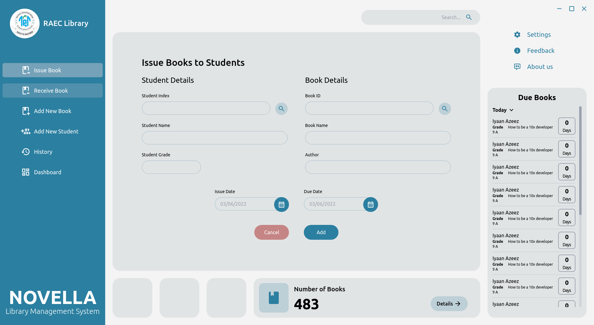

# Novella 

The library management software built around simplicity allowing librarians to issue books with just a few clicks. Library softwares today has the same outdated design from the 90’s. Novella changes this while still retaining the industry standard of contemporary software.  The simple controls, and the modern user interface helps navigate through easily,, lightening the learning curve to this program. 



# Tech stack
The application uses modern UI framework Vue.js and electron to make the development process much more easier and refined. Our main focus is to deliver uncompromising stability from the inside out so the user can take full advantage of Novella worry free


## Project setup
```
yarn install
```

### Compiles and hot-reloads for development
```
yarn electron:serve
```

### Compiles and minifies for production
```
yarn electron:build
```

### Lints and fixes files
```
yarn lint
```

